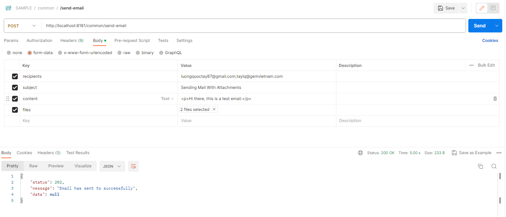

# Send Email With Attachment

### 1. Add dependency
```
<dependency>
    <groupId>org.springframework.boot</groupId>
    <artifactId>spring-boot-starter-mail</artifactId>
</dependency>
```

### 2. Mail Configuration in `application.properties`

- AWS SES Configuration
```
spring.mail.host=email-smtp.eu-west-1.amazonaws.com
spring.mail.username=${YOUR_SMTP_USERNAME}
spring.mail.password=${YOUR_SMTP_PASSWORD}
spring.mail.properties.mail.transport.protocol=smtp
spring.mail.properties.mail.smtp.port=587
spring.mail.properties.mail.smtp.auth=true
spring.mail.properties.mail.smtp.starttls.enable=true
spring.mail.properties.mail.smtp.starttls.required=true
from.email.address=${YOUR_EMAIL_ADDRESS}
```

- Gmail Configuration

```
application.propertiesdebug=true
spring.mail.host=smtp.gmail.com
spring.mail.port=25
spring.mail.username=admin@gmail.com
spring.mail.password=xxxxxx
# Other properties
spring.mail.properties.mail.debug=true
spring.mail.properties.mail.transport.protocol=smtp
spring.mail.properties.mail.smtp.auth=true
spring.mail.properties.mail.smtp.connectiontimeout=5000
spring.mail.properties.mail.smtp.timeout=5000
spring.mail.properties.mail.smtp.writetimeout=5000

# TLS , port 587
spring.mail.properties.mail.smtp.starttls.enable=true

# SSL, post 465
#spring.mail.properties.mail.smtp.socketFactory.port = 465
#spring.mail.properties.mail.smtp.socketFactory.class = javax.net.ssl.SSLSocketFactory
```

- Outlook Configuration

```
#spring.mail.host=smtp-mail.outlook.com
#spring.mail.port=587
#spring.mail.username=outlookuserid@outlook.com
#spring.mail.password=xxxxxx
#spring.mail.properties.mail.protocol=smtp
#spring.mail.properties.mail.tls=true
#spring.mail.properties.mail.smtp.auth=true
#spring.mail.properties.mail.smtp.starttls.enable=true
#spring.mail.properties.mail.smtp.ssl.trust=smtp-mail.outlook.com
```

### 3. Create MailService
```
@Service
@Slf4j(topic = "MAIL-SERVICE")
public class MailService {

    @Value("${from.email.address}")
    private String fromEmailAddress;

    @Autowired
    private JavaMailSender mailSender;

    public void sendEmail(String recipients, String subject, String content, MultipartFile[] files) throws UnsupportedEncodingException, MessagingException {
        log.info("Email is sending ...");

        MimeMessage message = mailSender.createMimeMessage();
        MimeMessageHelper helper = new MimeMessageHelper(message, true, CharEncoding.UTF_8);
        helper.setFrom(fromEmailAddress, "John Doe");

        if (recipients.contains(",")) { // send to multiple users
            helper.setTo(InternetAddress.parse(recipients));
        } else { // send to single user
            helper.setTo(recipients);
        }

        // Send attach files
        if (files != null) {
            for (MultipartFile file : files) {
                helper.addAttachment(Objects.requireNonNull(file.getOriginalFilename()), file);
            }
        }

        helper.setSubject(subject);
        helper.setText(content, true);
        mailSender.send(message);

        log.info("Email has sent to successfully, recipients={}", recipients);
    }
}

```

### 4. Create API `/send-email`
```
@RestController
@RequestMapping("/common")
@Slf4j(topic = "COMMON-CONTROLLER")
public record CommonController(CommonService commonService, MailService mailService) {
    ...
    @PostMapping("/send-email")
    public SuccessResponse sendEmail(@RequestParam String recipients, @RequestParam String subject,
                                        @RequestParam String content, @RequestParam(required = false) MultipartFile[] files) {
        log.info("Request GET /common/send-email");
        try {
            mailService.sendEmail(recipients, subject, content, files);
            return new SuccessResponse(ACCEPTED, "Email has sent to successfully");
        } catch (UnsupportedEncodingException | MessagingException e) {
            log.error("Sending email was failure, message={}", e.getMessage(), e);
            return new FailureResponse(BAD_REQUEST, "Sending email was failure");
        }
    }
    ...
}
```

### 5. Test API `/send-email` by Postman




---
***Source code:*** [GitHub](https://github.com/luongquoctay87/java-sample-code/tree/working-with-ses)

***Reference sources:*** [Spring boot – Send email with attachment](https://howtodoinjava.com/spring-boot2/send-email-with-attachment/)